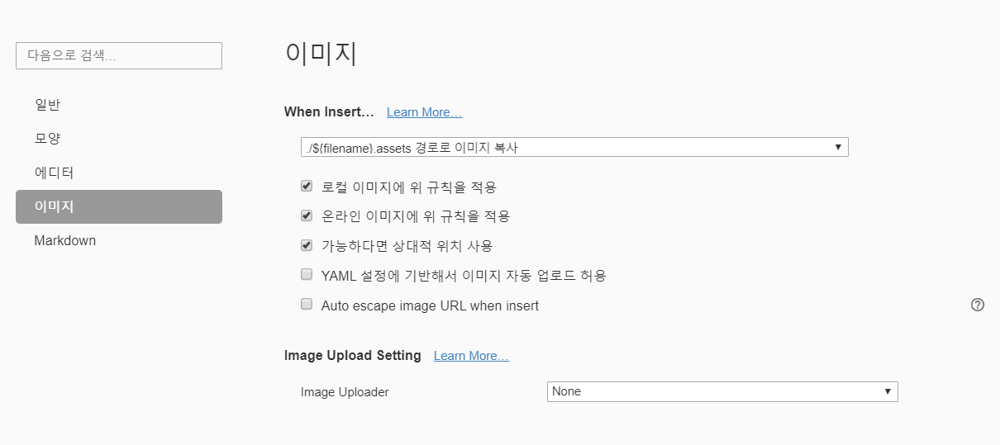

# linux 기초 문법

linux에서 사용가능한 기본 문법을 정리합니다.


### 현재 폴더 위치

- pwd (print working directory)

```shell
$ pwd
```


### 폴더 변경

- cd (change directory)

```shell
$ cd <이동하고 싶은 폴더 이름>
```


### 폴더, 파일 출력

- ls (list)
  - `-a` 옵션은 숨김파일까지 출력해준다.

```shell
$ ls -a
# -a 옵션은 숨김파일까지 출력해준다.
# `-a` 로 블락가능, 코드펜스
```


```python
def hello():
    print("asdf")

# 파이썬으로 나타낼 수도 있음
# 항상 정리를 손으로 하지말고 컴퓨터로 정리하는 습관 가지기
```


### 파일 생성

- touch

```shell
$ touch <생성할 파일 이름>
```


### 파일 삭제

- rm
  - 만약 폴더를 삭제하고 싶다면 `-r` 옵션을 추가해서 삭제가능

```shell
$ rm <삭제하고 싶은 파일 이름>
```


### 사진 첨부 방법




